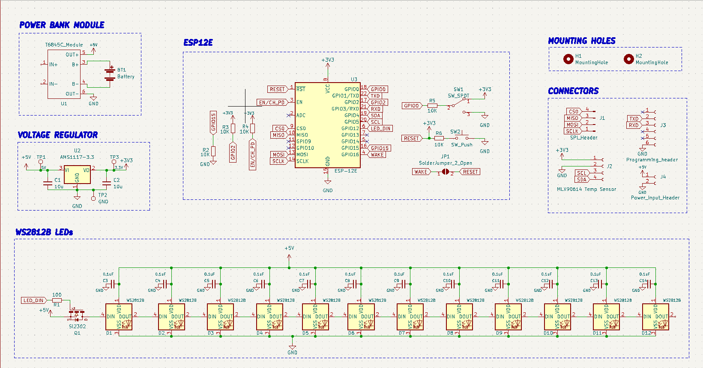
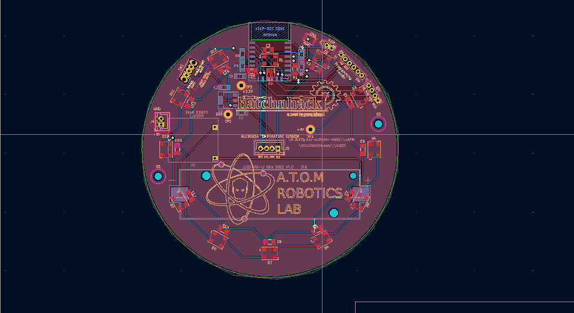

# Temperature Controlled LED Coaster

This project is an ESP12E based Temperature Controlled Smart Coaster. The project uses the following:
 * ESP12E Module
 * 12 x WS2812B SMD LEDs
 * MLX90614 Temperature Sensor I2C Module
 * Power Bank Charge-Boost Module for charging & boosting 3.7V of Li-Ion cell to 5V.
 * PCB Design was made using KICAD.
 
 
 This Project was made in Partnership with [hnhcart.com](https://www.hnhcart.com/) as sponsers and mentors.
 
 
 # Schematic

# PCB Design

